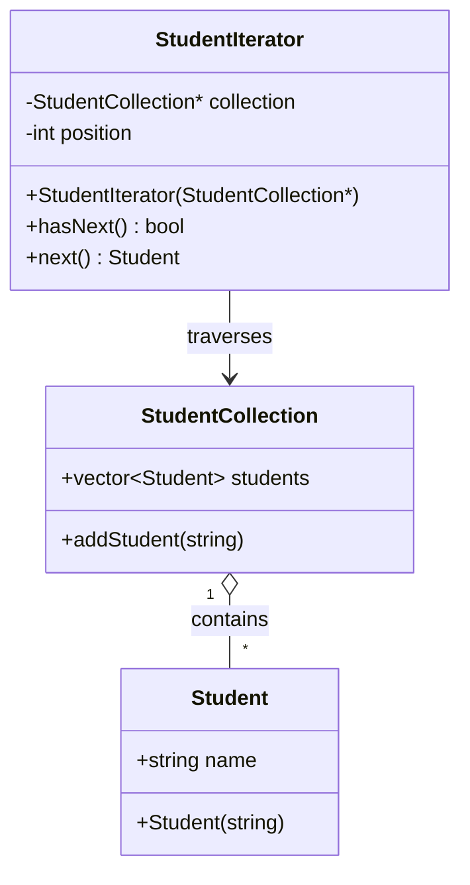

# Lab 03 -- Iterator Pattern

## 1. Pattern Name

**Iterator Pattern**

## 2. Category

**Behavioral Design Pattern**

## 3. Intent

The Iterator Pattern provides a way to access the elements of a
collection one by one without exposing how the collection is stored
internally.

Instead of directly handling the traversal inside the main program, a
separate iterator object is responsible for moving through the
collection.

## 4. Problem Statement

Suppose a university system stores a list of students. The program needs
to access every student one by one.

If the traversal logic is written directly everywhere the student list
is used, the code becomes dependent on how the collection is stored.
This makes the program harder to change and maintain.

The Iterator Pattern solves this problem by separating the collection
from the traversal process.

## 5. Motivation

Consider a `StudentCollection` containing several students. We want to
display every student without manually managing the traversal in
`main()`.

The Iterator Pattern introduces a `StudentIterator` with two simple
operations:

- `hasNext()` checks whether another student is available.
- `next()` returns the next student and moves the iterator forward.

This keeps the traversal logic inside the iterator instead of the client
code.

## 6. Pattern Structure (UML Class Diagram)



## 7. Class Responsibilities

- **Student** -- Represents a student and stores the student's name.
- **StudentCollection** -- Stores all `Student` objects and provides
  the `addStudent()` method for adding new students.
- **StudentIterator** -- Traverses the `StudentCollection`. It keeps
  track of the current position and provides `hasNext()` and `next()`.
- **Client (`main`)** -- Creates the collection, adds students,
  creates the iterator, and uses it to display the students.

## 8. Code Implementation

```cpp
#include <iostream>
#include <vector>
#include <string>
using namespace std;

// Student class
class Student {
public:
    string name;

    Student(string n) {
        name = n;
    }
};

// Student Collection
class StudentCollection {
public:
    vector<Student> students;

    void addStudent(string name) {
        students.push_back(Student(name));
    }
};

// Iterator
class StudentIterator {
private:
    StudentCollection* collection;
    int position;

public:
    StudentIterator(StudentCollection* c) {
        collection = c;
        position = 0;
    }

    bool hasNext() {
        return position < collection->students.size();
    }

    Student next() {
        return collection->students[position++];
    }
};

int main() {

    StudentCollection students;

    students.addStudent("Rahim");
    students.addStudent("Karim");
    students.addStudent("Sadia");

    StudentIterator iterator(&students);

    while (iterator.hasNext()) {
        Student student = iterator.next();
        cout << student.name << endl;
    }

    return 0;
}
```

### Output

```text
Rahim
Karim
Sadia
```

## 9. Execution Flow (Object Interaction)

1.  A `StudentCollection` object named `students` is created.
2.  Rahim, Karim, and Sadia are added to the collection.
3.  A `StudentIterator` is created and receives the address of the
    collection.
4.  The iterator starts with `position = 0`.
5.  `hasNext()` checks whether the current position is still inside the
    student list.
6.  `next()` returns the current student and increases `position` by
    one.
7.  The loop continues until all students have been displayed.

## 10. Advantages

- Separates traversal logic from the main program.
- Makes the collection easier to use.
- Provides simple sequential access using `hasNext()` and `next()`.
- Makes the code easier to understand and maintain.
- The client does not need to manage the iterator position directly.

## 11. Limitations

- Requires an additional iterator class.
- Can be unnecessary for a very small and simple collection.
- More complicated traversal may require additional iterator logic.

## 12. Real-life Applications

- Student and employee lists.
- Music playlists.
- Product catalogs.
- File and folder traversal.
- Contact lists.
- Database records.

## 13. Industry Examples

- C++ Standard Template Library (STL) iterators.
- Java Collection Framework iterators.
- Python iterators.
- Database result traversal.
- Collection traversal in many software frameworks.

## 14. Conclusion

The Iterator Pattern provides a simple way to traverse a collection
without putting traversal logic inside the client code. In this example,
`StudentCollection` stores the students while `StudentIterator` accesses
them one by one using `hasNext()` and `next()`. This separation makes
the program easier to understand, reuse, and maintain.
