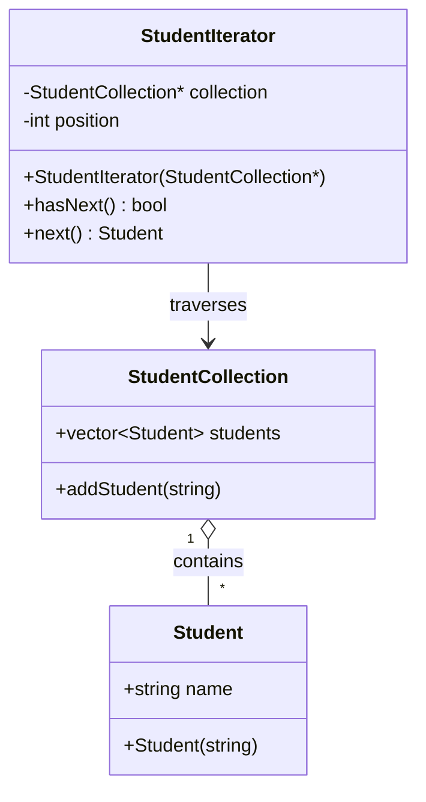
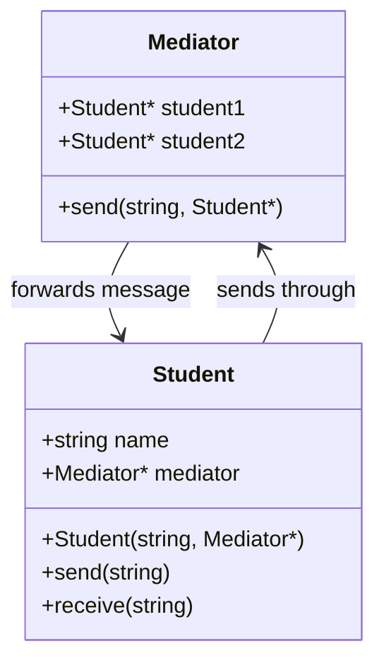
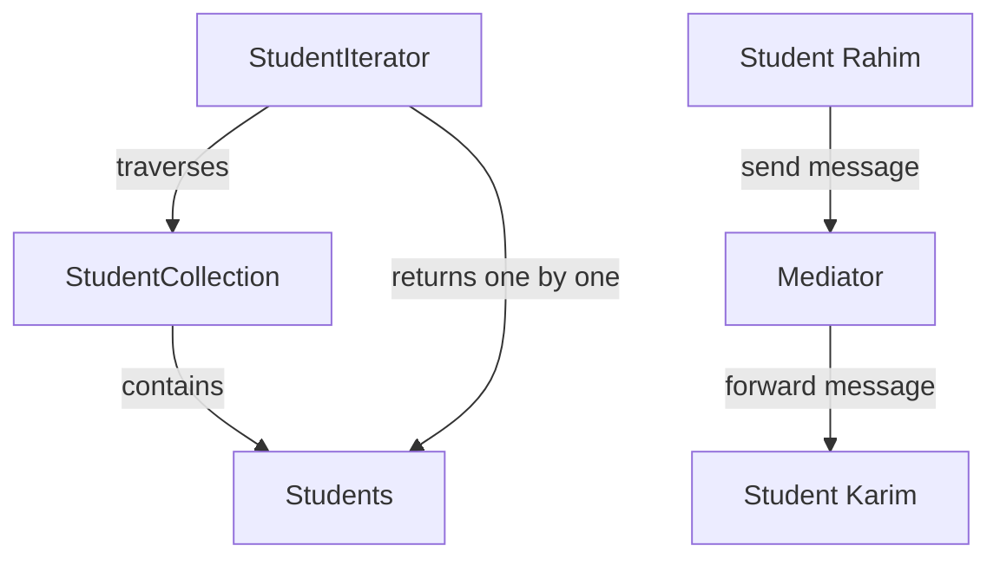

# Lab 03 -- Group 7 Overview

## Project Title

**University Course Communication System using Iterator and Mediator
Design Patterns**

## Assigned Patterns

Group 7 has:

- **Iterator Pattern**
- **Mediator Pattern**

Both are **Behavioral Design Patterns**.

## 1. Basic Idea

We use one university student scenario to demonstrate both patterns.

- **Iterator Pattern:** Used to go through a collection of students
  one by one.
- **Mediator Pattern:** Used to manage communication between students
  through a central mediator.

The two patterns solve different problems. Iterator focuses on
**traversal**, while Mediator focuses on **communication**.

## 2. Comparison of Iterator and Mediator Pattern

---

Iterator Pattern Mediator Pattern

---

Used to traverse a collection Used to manage communication

Focuses on accessing objects one by Focuses on interaction between
one objects

Uses `StudentIterator` Uses `Mediator`

Works with `StudentCollection` Works between `Student` objects

Uses `hasNext()` and `next()` Uses `send()` and `receive()`

Example: going through a student Example: sending a message between
list students

---

### Main Difference

The **Iterator Pattern** answers:

> "How can we access the objects in a collection one by one?"

The **Mediator Pattern** answers:

> "How can objects communicate without directly depending on each
> other?"

So, Iterator manages **object traversal**, whereas Mediator manages
**object communication**.

## 3. Iterator Pattern UML Structure



### Explanation of Iterator UML

The Iterator Pattern contains three main classes:

- **Student** represents one student and stores the student's name.
- **StudentCollection** stores multiple `Student` objects in a vector.
- **StudentIterator** is responsible for traversing the
  `StudentCollection`.

`StudentCollection` **contains** the students.

`StudentIterator` has a pointer to `StudentCollection` and keeps a
`position` variable. It uses `hasNext()` to check whether another
student exists and `next()` to return the next student.

The basic flow is:

`StudentCollection -> StudentIterator -> Students one by one`

## 4. Mediator Pattern UML Structure



### Explanation of Mediator UML

The Mediator Pattern contains two main classes:

- **Student** represents a student who can send and receive messages.
- **Mediator** manages communication between the two students.

Each `Student` has a pointer to the `Mediator`.

When one student calls `send()`, the message goes to the mediator. The
mediator checks who sent the message and forwards it to the other
student using `receive()`.

For example:

`Rahim -> Mediator -> Karim`

Rahim does not directly call Karim. The mediator controls the
communication.

## 5. Combined Diagram

The two patterns are used in the same university student scenario but
for different purposes.



### Combined Diagram Explanation

The upper part represents the **Iterator Pattern**:

`StudentIterator -> StudentCollection -> Students`

The iterator accesses the students in the collection one by one.

The lower part represents the **Mediator Pattern**:

`Rahim -> Mediator -> Karim`

The mediator handles communication between the students.

Therefore, both patterns can be demonstrated using students while
solving two different software design problems.

## 6. GitHub Repository Structure

```text
Group7-Design-Patterns/
│
├── Documentations/
│   ├── Iterator_Pattern_Documentation.md
│   ├── Mediator_Pattern_Documentation.md
│   └── Overview.md
│
├── Iterator Pattern/
│   └── iterator.cpp
│
└── Mediator Pattern/
    └── mediator.cpp
```

## 7. Conclusion

Iterator and Mediator are both Behavioral Design Patterns, but they
solve different problems.

The **Iterator Pattern** allows us to traverse students in a
`StudentCollection` one by one using `StudentIterator`. It separates the
traversal process from the collection.

The **Mediator Pattern** allows students to communicate through a
central `Mediator`. It reduces direct communication between the student
objects.

In our university student example, Iterator is responsible for
**traversing students**, while Mediator is responsible for
**communication between students**.

Together, the two patterns demonstrate how software can be divided into
clear responsibilities, making the program easier to understand and
maintain.
